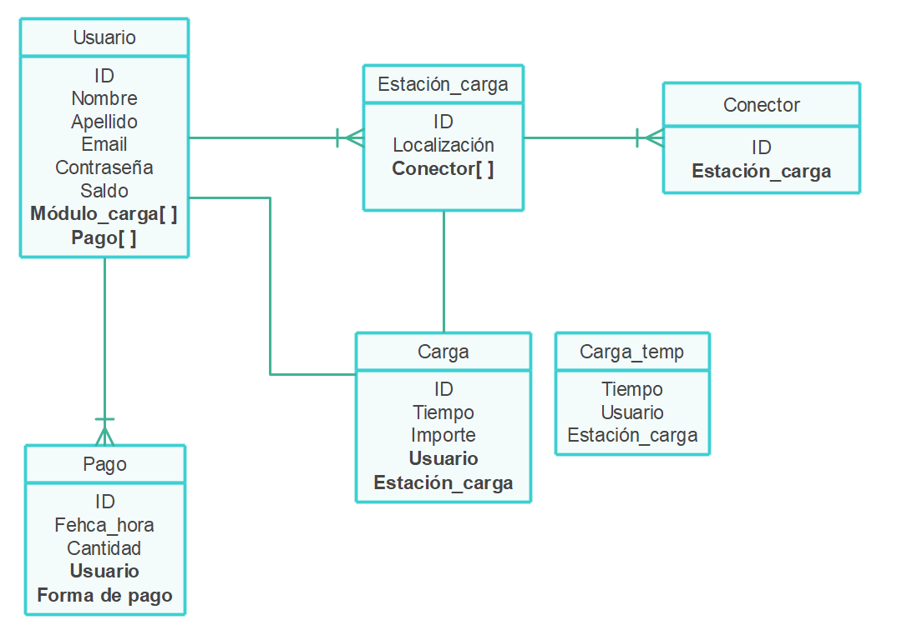

=======================
Introducción 
=======================

Contexto
-----------------------

Esta página recoge la información sobre el desarrollo de la aplicación para el Birloki Energy Activator, 
una solución con el objetivo de fomentar la movilidad sostenible. 

La aplicación móvil permitirá a los usuarios interactuar con la estación mediante un código QR, 
activando un cargador listo para ser usado. Para ello, se ha creado un modelo de datos y la especificación de la API que será utilizada.

La arqitectura de la solución propuesta es la siguiente:

* **Birloki**: La estación cuenta con un módulo de cargadores, que se activarán cuando los usuarios lo necesiten. Las estaciones estarán conectadas a la red, enviando y recibiendo información sobre los usuarios y el entorno.

* **Aplicación móvil**: Los usuarios deberán identificarse mediente la app para poder escanear el código QR que activará los cargadores. Esta aplicación gestionará todo lo relacionado con el servicio de alquiler de energía.

* **API**: La API se encargará de gestionar las peticiones de la aplicación, guardando y haciendo accesibles los datos necesarios.

* **Servidor**: Todos los dispositivos harán peticiones al servidor dedicado.

Prototipo
-----------------------

Estas con algunas de las capturas del prototipo de la aplicación, accesible desde este `enlace <https://kike408340.invisionapp.com/prototype/Mugiadi-app-ckh3p0rey001w3401r6mtl3yw/play/19346e7d>`_ .

El usuario podrá visualizar las estaciones cercanas mediante un mapa, y activar un cargador mediante el scan de un
código QR colocado en la estación Birloki, eligiendo el tiempo de carga deseado. 

.. image:: _static/p2.png
.. image:: _static/p5.png

Además, podrá consultar y editar la información de facturación.

.. image:: _static/p3.png
.. image:: _static/p4.png

Modelo de datos
-----------------------

El modelo de datos define la estructura de los datos que van a ser usados por la aplicación. Este esquema general muestra
las entidades más relevantes, sus atributos y la relación entre ellas.

Casos de uso
-----------------------

A continuación se describen los casos de uso más comunes, y cómo es el flujo de información durante la interacción
de el usuario con el servidor:

- Login

.. image:: _static/login.png

- Activación de cargador

.. image:: _static/activar.png

- Consuta de datos de usuario

.. image:: _static/perfil.png

- Gestión de pago

.. image:: _static/pagar.png

